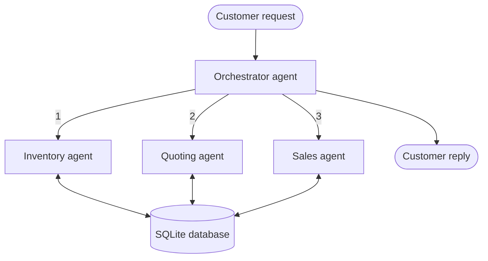

# Munder Difflin Multi-Agent System

A multi-agent system for Munder Difflin, a paper supply company. It reads free-text customer requests, checks inventory, generates quotes with bulk discounts, and completes sales, all against a SQLite database.

Built with [smolagents](https://github.com/huggingface/smolagents) and `gpt-4o-mini` .

## Architecture

Four agents, within the project limit of five:

| Agent | Role | Tools |
| --- | --- | --- |
| **Orchestrator** | Reads the request, delegates in a fixed order, writes the customer reply | `delegate_to_inventory_agent`, `delegate_to_quoting_agent`, `delegate_to_sales_agent` |
| **Inventory agent** | Maps customer wording to catalog items, checks stock | `find_catalog_items_tool`, `check_stock_level_tool`, `check_inventory_tool`, `get_delivery_date_tool`, `check_cash_balance_tool`, `reorder_stock_tool` |
| **Quoting agent** | Prices the order with bulk discounts, informed by past quotes | `search_quote_history_tool`, `calculate_quote_tool`, `find_catalog_items_tool` |
| **Sales agent** | Finalizes each item, restocking from the supplier when the deadline and cash allow | `fulfill_order_tool`, `check_stock_level_tool`, `get_delivery_date_tool`, `financial_report_tool` |



The full workflow diagram, with every tool and decision point, is in [`agent_workflow.mmd`](agent_workflow.mmd). Open it in [mermaid.live](https://mermaid.live) to view it.

### Business rules

The model decides which step to take next. Every price, stock count and database write is computed in Python tools, so the model cannot invent numbers.

- **Bulk discounts** by total units ordered: 5% from 1,000 units, 10% from 5,000, 15% from 10,000.
- **Restocking** buys the shortfall plus the item's minimum stock level. It happens only if the supplier can deliver by the customer's deadline and cash stays above a $1,000 reserve.
- **Safeguards:**
  - Dates come from the request itself, never from the model.
  - Each agent runs at most once per request.
  - Each item is sold at most once per request.

## Project files

| File | Purpose |
| --- | --- |
| `project_starter.py` | The multi-agent system and the evaluation run |
| `evaluate_results.py` | Summarizes `test_results.csv` (sales, declines, cash and inventory change) |
| `agent_workflow.mmd` | Workflow diagram (Mermaid) |
| `Munder_Difflin_Multi_Agent_Report.docx` | Project report: system explanation, evaluation, improvements |
| `quote_requests.csv`, `quotes.csv` | Historical requests and quotes loaded into the database |
| `quote_requests_sample.csv` | The 20 test requests |
| `test_results.csv` | Output of the evaluation run |
| `requirements.txt` | Python dependencies |

## Setup

1. Install the dependencies (Python 3.10+):
   ```bash
   pip install -r requirements.txt
   ```
2. Create a `.env` file in the project folder with your API key:
   ```
   OPENAI_API_KEY=your-key-here
   ```
   The code calls `gpt-4o-mini` through Udacity's Vocareum endpoint (`https://openai.vocareum.com/v1`). `UDACITY_OPENAI_API_KEY` is also accepted.
3. Keep the CSV files either next to `project_starter.py` or in a `project/` subfolder; the script looks in both.

## Running

```bash
python project_starter.py     # runs all 20 test requests (about 15 minutes)
python evaluate_results.py    # prints a summary of the results
```

`project_starter.py` resets the database (`munder_difflin.db`) and processes each request in date order. It prints each reply with the updated cash and inventory value. At the end it writes `test_results.csv` to the folder you run it from. The file is written only when the run completes, so stopping early with Ctrl+C leaves no new results.

## Results

From the latest run of the 20 sample requests:

| Measure | Value |
| --- | --- |
| Requests with at least one sale | 8 of 20 |
| Cash | $45,059.70 → $45,202.00 (+$142.30) |
| Inventory value | $4,940.30 → $4,668.40 (−$271.90) |

**What works:**
- Every recorded price and bulk discount is exact.
- Supplier deadlines are respected.
- Partial orders still sell the items that can ship on time.

**Main weakness:** in 8 requests the agents called catalog items "not in our catalog". The tools accept only the exact catalog spelling of an item name, and the model passes their errors on to the customer.

See the report for the full analysis and suggested improvements.
